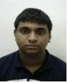

# Sarthak Sarkar

#
Hello my name is Sarthak Sarkar.I want to become a software engineer once I grow up.My hobbies are playing cricket and reading book.
#
Education
| Year of graduation |  Degree  | Institution |
| :----------------: | :------: | ----------: |
|        2019        | class 10 |  DPS Bhopal |
|        2021        | class 12 |  DPS Bhopal |
|        2024        |  B.Tech  |     IIT Goa |
autumn semester
- ## CS101: Introduction to computing by *Dr. Clint P George* [link](https://clintpgeorge.github.io/cs-101/autumn-2021/)

spring semester
1. *CS102:*Software Tools by <u>Dr. Clint P George</u> [link](https://clintpgeorge.github.io/cs-102/spring-2021/)

#
In markdown language I learned many things like making a table, pasting links showing an image and making my own page

